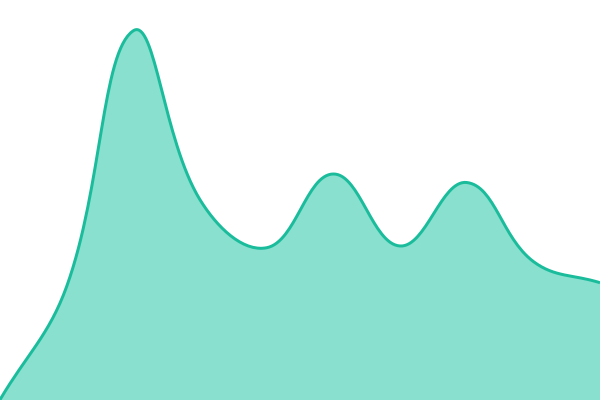
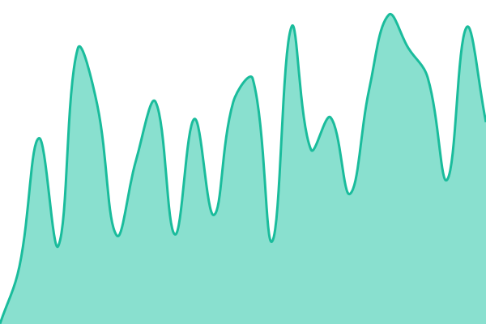

# [📈 Live Status](https://abingdonflooring.github.io/status): <!--live status--> **🟧 Partial outage**

This repository contains the open-source uptime monitor and status page for [abingdonflooring](https://abingdonflooring.github.io/status), powered by [Upptime](https://github.com/upptime/upptime).

With [Upptime](https://upptime.js.org), you can get your own unlimited and free uptime monitor and status page, powered entirely by a GitHub repository. We use [Issues](https://github.com/abingdonflooring/status/issues) as incident reports, [Actions](https://github.com/abingdonflooring/status/actions) as uptime monitors, and [Pages](https://abingdonflooring.github.io/status) for the status page.

<!--start: status pages-->
<!-- This summary is generated by Upptime (https://github.com/upptime/upptime) -->
<!-- Do not edit this manually, your changes will be overwritten -->
<!-- prettier-ignore -->
| URL | Status | History | Response Time | Uptime |
| --- | ------ | ------- | ------------- | ------ |
|  [Alliance Portal](https://portal.alliancefdl.co.uk/alliance/) | 🟩 Up | [alliance-portal.yml](https://github.com/abingdonflooring/status/commits/HEAD/history/alliance-portal.yml) | 

 903ms
     
 | 

<a href="https://abingdonflooring.github.io/status/history/alliance-portal">100.00%</a>
    

|  [Customer Portal](https://portal.abingdonflooring.co.uk/) | 🟩 Up | [customer-portal.yml](https://github.com/abingdonflooring/status/commits/HEAD/history/customer-portal.yml) | 

 1109ms
     
 | 

<a href="https://abingdonflooring.github.io/status/history/customer-portal">100.00%</a>
    

|  [Customer Warranty registration](https://stainfreeforlife.com/) | 🟩 Up | [customer-warranty-registration.yml](https://github.com/abingdonflooring/status/commits/HEAD/history/customer-warranty-registration.yml) | 

 792ms
     
 | 

<a href="https://abingdonflooring.github.io/status/history/customer-warranty-registration">100.00%</a>
    

|  [AFL Homepage](https://www.abingdonflooring.co.uk) | 🟥 Down | [afl-homepage.yml](https://github.com/abingdonflooring/status/commits/HEAD/history/afl-homepage.yml) | 

 906ms
     
 | 

<a href="https://abingdonflooring.github.io/status/history/afl-homepage">87.50%</a>
    

<!--end: status pages-->

[**Visit our status website →**](https://abingdonflooring.github.io/status)

## 📄 License

- Powered by: [Upptime](https://github.com/upptime/upptime)
- Code: [MIT](./LICENSE) © [abingdonflooring](https://abingdonflooring.github.io/status)
- Data in the `./history` directory: [Open Database License](https://opendatacommons.org/licenses/odbl/1-0/)
